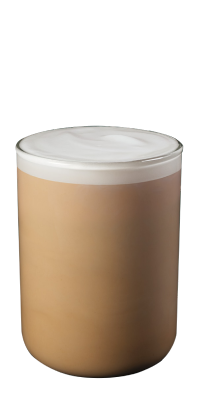

# ☕️ twosome place ☕️


>Before, Checking my website. Please check my all Potfolios with Chorme and this website is based on 1440px :) 

### 📍https://sumin03.github.io/twosomeplace/. 
Twosome place is the franchise cafe like starbucks in Korea. 


## Table of Content 
* **[Home](#home)**
* **[New_menu](#new_menu)**
* **[Menu](#menu)**
* **[Menu_list](#menu_list)** 
* **[Menu_detail](#menu_detail)**
* **[Store](#store)**
* **[Event](#event)**

## Features 
* Responsive (break points: 1440px, 1024px, 414px)
* Javascript
* Jquery
* html 
* css
* Animation 
* Warm colors (Using twosome place representative colors)
* Design in Figma (layout) 
* Design in Photoshop/ illustrator (banner..etc)
* All design and coding by myself 
* Geometric design

## Problems 
Every skills (especially figma) were taught by myself so I was struggled to adjust everything.
I also had problems Making code efficient way but after studying Using 'root' element on CSS.
I tried to fix the code by myself. I will attach the difference below so Please Check it out :) 


This is the one I tried to change. Using ':root' property looks better/ change the css value easier. 

As you can see on my github css history 


There has differece before and now! 
Using root can be easier to change value later. 


## Goals 
_1.Making responsive webpage <br>_
_2.Trying to using Figma when I make layout <br>_
_3.Using javascript and jquery at the same time<br>_
_4.Using twosome place representative colors to show their identity <br>_
_5.Trying to make every elements to appealing <br>_


## Home

#### First, 
I wanted to make this part much more appealing to viewer, so I tried to change _header part_ in the different way. 
And using all representative colors when I design, to make every one clearly know they are using TWOSOME PLACE website. 
> 

this is the original twosome place website design 


but I changed like this.. 

 


>> Skills that I used for this website 

Mostly I tried to use flex box when I make this website for responsive. 
Also I used library for mobile page. 

```html 
    <script src="https://unpkg.com/swiper/swiper-bundle.js"></script>
    <script src="https://unpkg.com/swiper/swiper-bundle.min.js"></script>

```
I added this library on my html <head></head>

```html 
 <!-- Slider main container -->
            <div class="swiper-container">
                <!-- Additional required wrapper -->
                <div class="swiper-wrapper">
                    <!-- Slides -->
                    <div class="swiper-slide">
                        <div class="box_one">
                            
                            <h2>Iced Cafe Latte</h2>
                            <p>풍부하고 진한 농도의 에스프레소와<br>
                            시원한 우유가 어우러진 부드러운 에스프레소 음료
                            </p>
                            <div class="hover" id="mobile_not">
                                <ul class="size">
                                    <li>SIZE</li>
                                    <li>
                                        <select name="beverage size">
                                            <option value="regular">Regular</option>
                                            <option value="large">Large</option>
                                            <option value="Max">Max</option>
                                        </select>
                                    </li>
                                </ul>
                                <ul class="size">
                                    <li>TYPE</li>
                                    <li>
                                        <select name="beverage Type">
                                            <option value="hot">Hot</option>
                                            <option value="Iced">Iced</option>
                                        </select>
                                    </li>
                                </ul>
                                <ul class="size">
                                    <li>BEANS</li>
                                    <li>
                                        <select name="beverage beans">
                                            <option value="black">Black Ground</option>
                                            <option value="aroma">Aroma Note</option>
        
                                        </select>
                                    </li>
                                </ul>
                            </div>
                        </div>
                    </div>
              </div>
```
And then I wrote my code like this to make mobile touch slider. 
I wanted to give difference, so I made this slider to work when you swipe up and down.
then you can see another menu. 

here is the gif file 👇


## New_menu 


 


